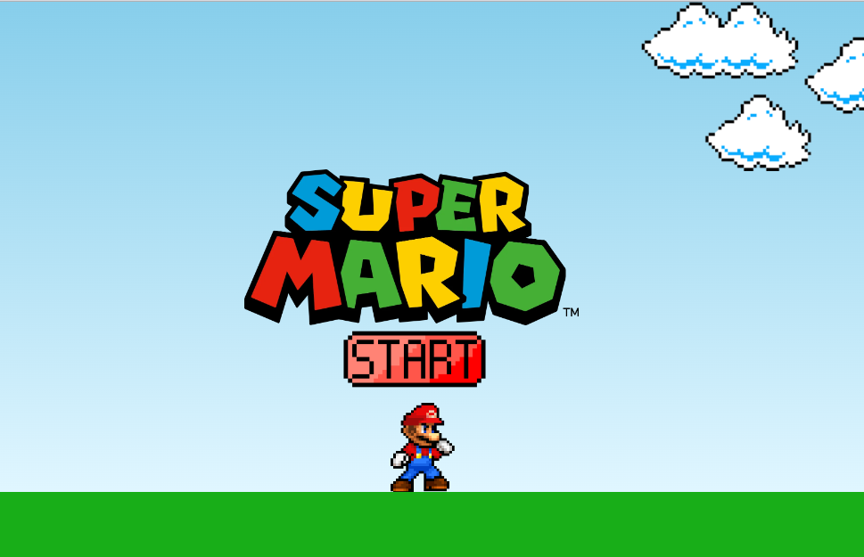

# .StartSe-tech-academy-Super-Mario

### Criando um Jogo simples do Super Mário

## 🏁 Tópicos

  * 👉 [Banner](#📷-banner)
  * 👉 [Título](#📌-título)
  * 👉 [Descrição](#✒️-descrição)
  * 👉 [Status](#⏱️-status)
  * 👉 [Funcionalidades](#🔨-funcionalidades-🛠️)
  * 👉 [Demonstração](#🚀-demonstração)
  * 👉 [Pré-requisitos](#📋-pré-requisitos)
  * 👉 [Tecnologias utilizadas](#⚙️-tecnologias-utilizadas)
  * 👉 [Acesso ao Projeto](#📁-acesso-ao-projeto)
  * 👉 [Pessoas Contribuidoras](#🖇️-pessoas-contribuidoras-🤝)
  * 👉 [Autor](#🏆-autor)
  * 👉 [Licença](#🙏-licença-🔖) 
  * 👉 [Conclusão](#📚-conclusão)

 
___

## 📷 Banner
  

    
  

___
## 📌 Título

#### Criando um Jogo simples do Super Mário

___
## ✒️ Descrição

#### utilizando HTML, CSS e Javascript, criei um jogo simples seguindo o tutorial da aula da .StartSe.

___
## ⏱️ Status

>  🚀 Projeto Concluído com Sucesso!!! 👌 🚧

___
## 🔨 Funcionalidades 🛠️

- `1 `  ✔️ `HTML`
- `2 `  ✔️ `CSS`
- `3 `  ✔️ `Javascript`

___
## 🚀 Demonstração 

> 🚧 Em construção 🚧

___
## 📋 Pré-requisitos 

- ✔️ Nenhum

___
## ⚙️ Tecnologias utilizadas

| [ <h4>Javascript</h4>](https://www.javascript.com/) | [ <h4>Git</h4>](https://pt.wikipedia.org/wiki/HTML) | [ <h4>GitHub</h4>](https://github.com/)
| :---: | :---: | :---: | 

___
## 📁 Acesso ao Projeto 

### [Projeto](https://alinealmeida85.github.io/.StartSe-tech-academy-Super-Mario/)

___
## 🏆 Autor 

  <a href="https://github.com/AlineAlmeida85">
     
    
      <b>Aline Almeida</b>
    
  </a> 
  

___
## Licença 🔖

#### Não Possui

____
 

  <h4>Feito com ❤️ por 
    <a href="https://github.com/AlineAlmeida85">Aline Almeida</a><h4>👋🏽 Entre em contato! 😊</h4>
  </h4> 

| [ ]() | [ ]() |  [ ]() |
| :---: | :---: | :---: |

 
<h4> Espero que te agrade! 🙏</h4>

 

